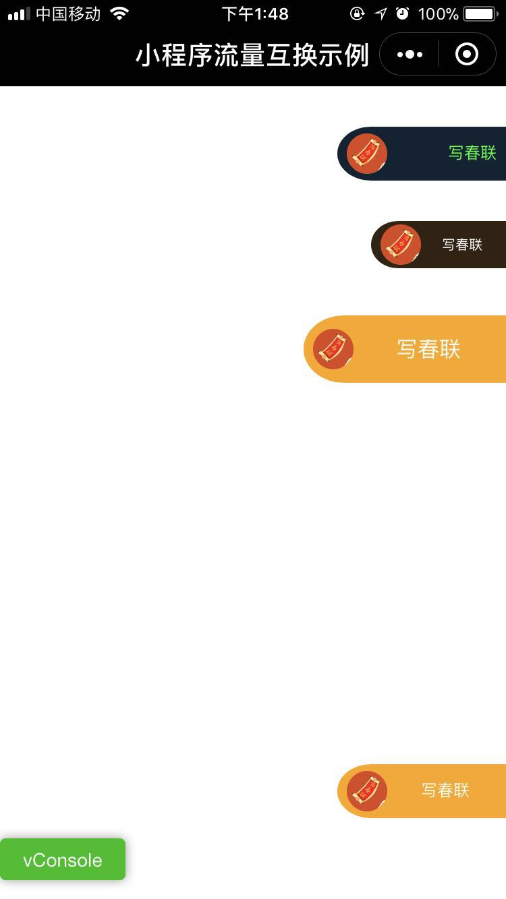

# mp-traffic-exchange

小程序流量互换示例

## 简介

	使用中间小程序，所有参与互推方统一绑定系统小程序到自己公众号下，在页面增加互推组件，点击后通过中间小程序跳转到目标小程序
	接下来会实现：
		1. 互推组件增加更多玩法方案
		2. 自动报名和提交小程序基础信息页面
		4. 增加统计，记录小程序之间的访问量和推广转化率
		5. 根据转发量智能匹配最佳互推方案，包括互推差额自动补全、自动显示和自动显示&隐藏互推组件
		6. 允许用户指定互推的小程序

## 加入说明

	1. 添加微信 Ray-Snow1122 注明：加入小程序流量互推， 发送自己的小程序appId、小程序头像、小程序名称
	2. 将转跳小程序（appId：wxfe119db5c0ae39d6）绑定到自己公众号下，没有公众号的个人开发者，请联系微信绑定
	3. 管理后台添加服务域名  "https://www.xisole.cn/"
	4. clone代码并添加，提交微信审核

## Usage

结合[微信自定义组件](https://mp.weixin.qq.com/debug/wxadoc/dev/framework/custom-component/), 参考 `pages/example` 使用

## 组件说明

1. 广告组件 `/components/mp-traffic-exchange/ad`

```json
{
    "usingComponents": {
        "mp-traffic-exchange-ad": "../components/mp-traffic-exchange/ad"
    }
}
```

```xml
<!-- 更多示例参考page/example.wxml -->
<mp-traffic-exchange-ad
    appId="wx957c50ff41081cf7"
    style="text-align: right; color: #0f3; background-color: #123;"
></mp-traffic-exchange-ad>
```



## Other

这项目只是示例, 也可以自己请求接口展示其它小程序广告.

约定以如下方式跳转推荐小程序

```js
 wx.navigateToMiniProgram({
    appId: jumpAppId, // 中间小程序appId, 接口返回
    extraData: {
        appId, // 推荐小程序appId, 接口返回
    },
});
```
